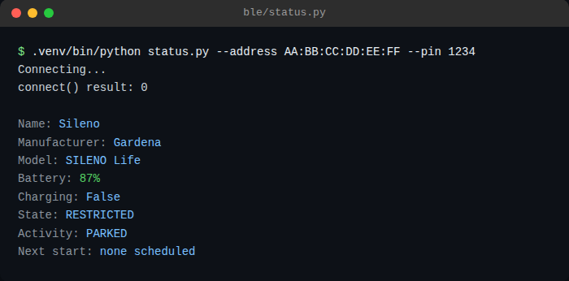
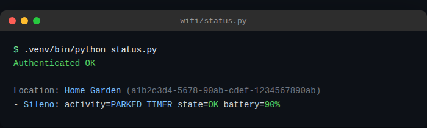

# gardena-sileno-toolkit

Small scripts to read live status (battery, activity, state) from GARDENA
Sileno robotic mowers, for both connectivity tiers Gardena sells them with:

- **`wifi/`** - cloud-connected Sileno models, via the official GARDENA
  Smart System API (OAuth2 + REST + websocket push).
- **`ble/`** - Bluetooth-only Sileno models (no app/cloud connectivity at
  all), via direct local BLE using [automower-ble](https://github.com/alistair23/AutoMower-BLE).

Built and tested on a Raspberry Pi (Debian/Raspberry Pi OS), talking to a
real GARDENA smart system account and a real Bluetooth-only Sileno.

## Why this exists

The WiFi side is straightforward and has decent existing tooling (see
[py-smart-gardena](https://github.com/py-smart-gardena/py-smart-gardena),
which `wifi/gardena_client.py` is loosely based on).

The Bluetooth-only side is the part worth reading if you're stuck: Gardena's
Bluetooth-only Sileno models flatly reject standard BLE pairing from an
unrecognized central, in a way that looks identical to "it's broken" but
isn't. See [`ble/README.md`](ble/README.md) for the full story and the
working fix.

## wifi/ - cloud-connected Sileno

1. Sign in at [developer.husqvarnagroup.cloud](https://developer.husqvarnagroup.cloud/)
   with your regular GARDENA account, create an application, and connect
   both the **Authentication API** and **GARDENA smart system API** to it.
   Copy the application key and secret it gives you.
2. `cd wifi && python3 -m venv .venv && .venv/bin/pip install -r requirements.txt`
3. `cp .env.example .env` and fill in `GARDENA_CLIENT_ID` / `GARDENA_CLIENT_SECRET`.
4. `.venv/bin/python status.py` for a one-shot status read, or
   `.venv/bin/python watch.py` for live websocket updates (auto-reconnects,
   handles token refresh).
5. Optional: `gardena-watch.service.example` is a systemd unit template to
   run `watch.py` persistently - copy it to
   `/etc/systemd/system/gardena-watch.service`, fill in the paths/user, then
   `systemctl daemon-reload && systemctl enable --now gardena-watch`.

The GARDENA API throttles plain REST calls (roughly one call per 15 min is
the community-observed safe rate) - that's why `watch.py` does one REST
call to get going and then relies on the websocket for everything else.

## ble/ - Bluetooth-only Sileno

See [`ble/README.md`](ble/README.md).

## License

MIT, see [LICENSE](LICENSE).
